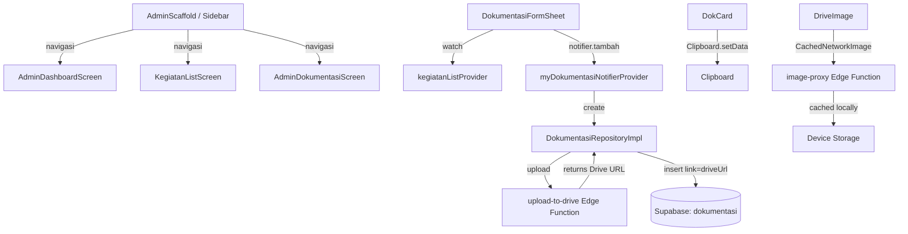

# Design Document — App Enhancement: Proyek & Cache

## Overview

Dokumen ini mendeskripsikan desain teknis untuk serangkaian peningkatan pada aplikasi Flutter `pantau_pegawai_v2`. Keenam fitur ini bersifat independen satu sama lain dan dapat diimplementasikan secara paralel, namun semuanya berbagi konteks yang sama: Flutter + Supabase + Riverpod.

Perubahan utama yang dicakup:

1. **Image Caching** — Ganti `Image.network` di `DriveImage` dengan `CachedNetworkImage`.
2. **Rename Sidebar Kegiatan → Proyek** — Ubah label dan hapus item "Laporan" dari sidebar admin.
3. **Pembaruan Dashboard Admin** — Ganti statistik "Kegiatan Aktif" → "Jumlah Proyek" dan "Total Laporan" → "Total Dokumentasi".
4. **Dropdown Proyek di Form Dokumentasi** — Ganti `TextFormField` bebas dengan `DropdownButtonFormField` yang fetch dari tabel `kegiatan`.
5. **Tombol Copy Link Drive** — Hapus field input link, tampilkan tombol Copy Link di `DokCard`.
6. **Logo BPS** — Tambah aset logo, tampilkan di sidebar, jadikan launcher icon.

---

## Architecture

Aplikasi mengikuti arsitektur berlapis (layered architecture) dengan Riverpod sebagai state management:

```
Presentation Layer  →  Provider Layer  →  Repository Layer  →  Supabase / Edge Functions
(Widgets/Screens)      (Riverpod)          (Impl classes)        (Backend)
```

Semua perubahan dalam spec ini berada di **Presentation Layer** dan **Provider Layer**, kecuali fitur Copy Link yang juga menyentuh logika di Repository Layer (auto-save Drive URL ke kolom `link`).



---

## Components and Interfaces

### 1. `DriveImage` Widget (Modifikasi)

**File:** `lib/shared/widgets/drive_image.dart`

Ganti `Image.network` dengan `CachedNetworkImage` dari package `cached_network_image` (sudah ada di `pubspec.yaml`).

```dart
// Sebelum
Image.network(proxyUrl, ...)

// Sesudah
CachedNetworkImage(
  imageUrl: proxyUrl,
  width: width,
  height: height,
  fit: fit,
  placeholder: (context, url) => Container(
    width: width,
    height: height,
    color: AppColors.background,
    child: const Center(child: CircularProgressIndicator(strokeWidth: 2)),
  ),
  errorWidget: (context, url, error) => _placeholder(),
)
```

Tidak ada perubahan pada interface publik widget — parameter tetap sama.

---

### 2. `_AdminSidebar` Widget (Modifikasi)

**File:** `lib/shared/widgets/admin_scaffold.dart`

Perubahan pada `_AdminSidebar.build()`:

- **Header**: Ganti `Icon(Icons.people_alt_rounded)` dengan `Image.asset('assets/images/Logo-BPS.png', width: 48, height: 48)`.
- **Nav item "Kegiatan"**: Ubah `label: 'Kegiatan'` → `label: 'Proyek'`, icon tetap `Icons.assignment_outlined`.
- **Nav item "Laporan"**: Hapus `_NavItem` untuk route `/admin/laporan`.

Urutan nav items setelah perubahan:

1. Dashboard
2. Pegawai
3. **Proyek** _(sebelumnya: Kegiatan)_
4. Dokumentasi
5. Rekap Upload
6. Import Data

---

### 3. `DashboardStatsModel` (Modifikasi)

**File:** `lib/features/dashboard/domain/dashboard_stats_model.dart`

Rename field untuk mencerminkan semantik baru:

```dart
// Sebelum
final int kegiatanAktif;
final int totalLaporan;

// Sesudah
final int jumlahProyek;      // total COUNT(*) dari tabel kegiatan
final int totalDokumentasi;  // total COUNT(*) dari tabel dokumentasi
```

---

### 4. `dashboardStats` Provider (Modifikasi)

**File:** `lib/features/dashboard/presentation/dashboard_provider.dart`

Query diubah:

- `kegiatanAktif`: query `kegiatan` dengan filter `deadline >= today` → diganti dengan query `kegiatan` tanpa filter (COUNT semua baris).
- `totalLaporan`: query `laporan` → diganti dengan query `dokumentasi`.

```dart
final results = await Future.wait([
  client.from('users').select('id').eq('role', 'pegawai'),
  client.from('kegiatan').select('id'),        // semua proyek, tanpa filter
  client.from('dokumentasi').select('id'),     // total dokumentasi
]);
```

---

### 5. `AdminDashboardScreen` (Modifikasi)

**File:** `lib/features/dashboard/presentation/admin_dashboard_screen.dart`

Perubahan pada `StatCard` grid:

```dart
// Sebelum
StatCard(title: 'Kegiatan Aktif', value: stats.kegiatanAktif.toString(), ...)
StatCard(title: 'Total Laporan', value: stats.totalLaporan.toString(), ...)

// Sesudah
StatCard(
  title: 'Jumlah Proyek',
  value: stats.jumlahProyek.toString(),
  icon: Icons.folder_outlined,
  color: AppColors.accent,
  onTap: () => context.push('/admin/kegiatan'),
),
StatCard(
  title: 'Total Dokumentasi',
  value: stats.totalDokumentasi.toString(),
  icon: Icons.photo_library_outlined,
  color: AppColors.success,
  onTap: () => context.push('/admin/dokumentasi'),
),
```

Bagian "Laporan Terbaru" di bawah grid juga dihapus atau diganti dengan "Dokumentasi Terbaru" jika diperlukan. Berdasarkan requirements, cukup menghapus bagian tersebut karena tidak ada requirement untuk menampilkan dokumentasi terbaru di dashboard.

---

### 6. `kegiatanListProvider` — Provider Baru

**File:** `lib/features/kegiatan/presentation/kegiatan_provider.dart`

Tambahkan provider baru yang hanya mengambil daftar judul proyek untuk dropdown:

```dart
/// Daftar semua kegiatan/proyek untuk dropdown di form dokumentasi
@riverpod
Future<List<KegiatanModel>> kegiatanList(Ref ref) async {
  return ref.read(kegiatanRepositoryProvider).getAll();
}
```

Provider ini terpisah dari `kegiatanNotifierProvider` (yang digunakan admin) agar pegawai tidak memicu state management yang tidak perlu.

---

### 7. `DokumentasiFormSheet` (Modifikasi)

**File:** `lib/features/dokumentasi/presentation/dokumentasi_screen.dart`

Perubahan pada `_DokumentasiFormSheetState`:

**Hapus:**

- `TextEditingController _proyekController`
- `TextEditingController _linkController`
- `TextFormField` untuk "Proyek / Kegiatan"
- `TextFormField` untuk "Link (opsional)"

**Tambah:**

- State `String? _selectedProyek` untuk menyimpan judul proyek yang dipilih
- `DropdownButtonFormField<String>` yang watch `kegiatanListProvider`

```dart
// State baru
String? _selectedProyek;

// Widget baru
ref.watch(kegiatanListProvider).when(
  loading: () => const DropdownButtonFormField<String>(
    items: [],
    onChanged: null,
    decoration: InputDecoration(
      labelText: 'Proyek / Kegiatan *',
      suffixIcon: SizedBox(
        width: 20, height: 20,
        child: CircularProgressIndicator(strokeWidth: 2),
      ),
    ),
  ),
  error: (e, _) => Text('Gagal memuat proyek: $e',
      style: const TextStyle(color: AppColors.error)),
  data: (list) => DropdownButtonFormField<String>(
    value: _selectedProyek,
    decoration: InputDecoration(
      labelText: 'Proyek / Kegiatan *',
      prefixIcon: const Icon(Icons.work_outline),
      border: OutlineInputBorder(borderRadius: BorderRadius.circular(10)),
    ),
    hint: list.isEmpty
        ? const Text('Belum ada proyek tersedia')
        : const Text('Pilih proyek...'),
    items: list.map((k) => DropdownMenuItem(
      value: k.judul,
      child: Text(k.judul, overflow: TextOverflow.ellipsis),
    )).toList(),
    onChanged: list.isEmpty ? null : (v) => setState(() => _selectedProyek = v),
    validator: (v) => v == null ? 'Wajib pilih proyek' : null,
  ),
),
```

**Modifikasi `_handleSubmit`:**

- Gunakan `_selectedProyek` sebagai nilai `proyek` (bukan `_proyekController.text`)
- Hapus parameter `link` dari pemanggilan `tambah()`

---

### 8. `DokumentasiNotifier.tambah()` (Modifikasi)

**File:** `lib/features/dokumentasi/presentation/dokumentasi_provider.dart`

Hapus parameter `link` dari method `tambah()`. Drive URL akan di-set otomatis di repository layer.

---

### 9. `DokumentasiRepositoryImpl.create()` (Modifikasi)

**File:** `lib/features/dokumentasi/data/dokumentasi_repository_impl.dart`

Setelah `_uploadToGoogleDrive()` berhasil dan mengembalikan `imageUrl`, simpan URL tersebut juga ke kolom `link`:

```dart
// Sebelum
final data = await _client.from('dokumentasi').insert({
  ...
  'image_url': imageUrl,
  'link': link,  // dari parameter
}).select(...).single();

// Sesudah
final data = await _client.from('dokumentasi').insert({
  ...
  'image_url': imageUrl,
  'link': imageUrl,  // auto-set ke Drive URL yang sama
}).select(...).single();
```

Hapus parameter `link` dari signature method `create()`.

---

### 10. `DokCard` Widget (Modifikasi)

**File:** `lib/features/dokumentasi/presentation/dokumentasi_screen.dart`

Ganti tampilan link lama dengan tombol Copy Link:

```dart
// Sebelum — teks link yang bisa diklik
if (doc.link != null) ...[
  GestureDetector(
    onTap: () async { /* launchUrl */ },
    child: const Row(children: [
      Icon(Icons.link, ...),
      Text('Link', ...),
    ]),
  ),
],

// Sesudah — tombol Copy Link
if (doc.link != null)
  GestureDetector(
    onTap: () async {
      await Clipboard.setData(ClipboardData(text: doc.link!));
      if (context.mounted) {
        ScaffoldMessenger.of(context).showSnackBar(
          const SnackBar(
            content: Text('Link berhasil disalin!'),
            duration: Duration(seconds: 2),
          ),
        );
      }
    },
    child: const Row(children: [
      Icon(Icons.copy_outlined, size: 11, color: AppColors.primary),
      SizedBox(width: 2),
      Text('Copy Link',
          style: TextStyle(fontSize: 11, color: AppColors.primary)),
    ]),
  ),
```

Import yang perlu ditambahkan: `import 'package:flutter/services.dart';`

---

### 11. Logo BPS — Aset & Launcher Icon

**Langkah-langkah:**

1. **Copy file**: `scrap_kippapp/Logo-BPS.png` → `pantau_pegawai_v2/assets/images/Logo-BPS.png`

2. **pubspec.yaml** — `assets/images/` sudah terdaftar, tidak perlu perubahan tambahan.

3. **Tambah `flutter_launcher_icons`** ke `dev_dependencies` di `pubspec.yaml`:

   ```yaml
   dev_dependencies:
     flutter_launcher_icons: ^0.14.1
   ```

4. **Konfigurasi launcher icons** di `pubspec.yaml`:

   ```yaml
   flutter_launcher_icons:
     android: true
     ios: true
     image_path: "assets/images/Logo-BPS.png"
     min_sdk_android: 21
     adaptive_icon_background: "#FFFFFF"
     adaptive_icon_foreground: "assets/images/Logo-BPS.png"
   ```

5. **Jalankan generator** (dilakukan saat implementasi):
   ```bash
   dart run flutter_launcher_icons
   ```

---

## Data Models

### `DashboardStatsModel` (Diperbarui)

```dart
class DashboardStatsModel {
  final int totalPegawai;
  final int jumlahProyek;       // ganti kegiatanAktif
  final int totalDokumentasi;   // ganti totalLaporan
  final int pegawaiBelumUpload;
}
```

### `DokumentasiModel` (Tidak berubah)

Model tidak berubah — kolom `link` tetap ada dan digunakan untuk menyimpan Drive URL secara otomatis.

### `KegiatanModel` (Tidak berubah)

Model tidak berubah — field `judul` digunakan sebagai nilai dropdown.

---

## Correctness Properties

_A property is a characteristic or behavior that should hold true across all valid executions of a system — essentially, a formal statement about what the system should do. Properties serve as the bridge between human-readable specifications and machine-verifiable correctness guarantees._

Setelah melakukan prework analysis terhadap semua acceptance criteria, sebagian besar kriteria dalam spec ini bersifat **UI rendering checks**, **configuration checks**, dan **integration tests** yang tidak cocok untuk property-based testing. Namun terdapat beberapa kriteria yang memiliki sifat universal dan dapat diuji sebagai property.

**Property Reflection:**

Dari prework analysis, kriteria yang teridentifikasi sebagai PROPERTY adalah:

- 2.5: Active state sidebar berdasarkan route
- 4.1, 4.2, 4.3: Dropdown menampilkan semua proyek, nilai yang dipilih sesuai judul
- 4.6: Validasi form — proyek wajib dipilih
- 5.3, 5.4: Copy Link muncul dan berfungsi untuk semua dokumentasi dengan link

Setelah refleksi:

- 4.1 dan 4.3 dapat digabung: keduanya menguji bahwa semua proyek dari sumber data muncul di dropdown tanpa filter.
- 5.3 dan 5.4 dapat digabung: keduanya menguji perilaku Copy Link untuk dokumentasi dengan link non-null.
- 4.2 dan 4.6 tetap terpisah karena menguji aspek berbeda (nilai yang dipilih vs validasi submit).

### Property 1: Sidebar active state mengikuti route

_Untuk semua_ route yang dimulai dengan `/admin/kegiatan`, item navigasi "Proyek" di sidebar harus memiliki state `isActive = true`, dan semua item lainnya harus memiliki `isActive = false`.

**Validates: Requirements 2.5**

---

### Property 2: Dropdown menampilkan semua proyek tanpa filter

_Untuk semua_ daftar `KegiatanModel` yang valid (termasuk proyek dengan deadline yang sudah lewat, berbagai judul, berbagai ukuran list), `DropdownButtonFormField` di form dokumentasi harus menampilkan tepat sebanyak item yang ada di daftar tersebut — tidak lebih, tidak kurang.

**Validates: Requirements 4.1, 4.3**

---

### Property 3: Nilai dropdown sesuai judul proyek yang dipilih

_Untuk semua_ `KegiatanModel` yang valid dalam daftar dropdown, ketika pengguna memilih item tersebut, nilai `_selectedProyek` harus sama persis dengan `kegiatan.judul` dari item yang dipilih.

**Validates: Requirements 4.2**

---

### Property 4: Validasi form menolak submit tanpa proyek

_Untuk semua_ state form dokumentasi yang valid (foto ada/tidak ada, catatan ada/tidak ada, tanggal valid) di mana proyek belum dipilih (`_selectedProyek == null`), pemanggilan `_handleSubmit()` harus mengembalikan false dan tidak memanggil repository.

**Validates: Requirements 4.6**

---

### Property 5: Copy Link muncul dan berfungsi untuk semua dokumentasi dengan link

_Untuk semua_ `DokumentasiModel` dengan `link != null`, widget `DokCard` harus menampilkan tombol "Copy Link", dan menekan tombol tersebut harus menyalin nilai `doc.link` ke clipboard.

**Validates: Requirements 5.3, 5.4**

---

## Error Handling

### Image Caching

- Jika gambar gagal dimuat dari jaringan maupun cache: tampilkan `_placeholder()` (ikon gambar abu-abu). Ini sudah ditangani oleh `errorWidget` di `CachedNetworkImage`.
- Tidak ada perubahan pada error handling yang sudah ada.

### Dropdown Proyek

- Jika `kegiatanListProvider` mengembalikan error: tampilkan teks error di posisi dropdown, form tetap bisa ditutup.
- Jika daftar kosong: dropdown disabled dengan hint "Belum ada proyek tersedia".
- Jika proyek tidak dipilih saat submit: validator menampilkan pesan "Wajib pilih proyek" di bawah dropdown.

### Dashboard Stats

- Jika query gagal: `statsAsync.error` sudah ditangani di `AdminDashboardScreen` — tampilkan `Text('Error: $e')`. Untuk UX yang lebih baik, bisa ditambahkan tombol retry dengan `ref.invalidate(dashboardStatsProvider)`.

### Copy Link

- Jika `Clipboard.setData` gagal (sangat jarang): tidak ada SnackBar yang muncul. Bisa ditambahkan try-catch untuk menampilkan pesan error jika diperlukan.

### Logo BPS

- Jika file aset tidak ditemukan saat runtime: Flutter akan throw `FlutterError`. Pastikan file ada sebelum build.

---

## Testing Strategy

Fitur ini didominasi oleh perubahan UI dan konfigurasi. Strategi pengujian menggunakan pendekatan dual:

### Unit Tests (Example-based)

Fokus pada verifikasi konkret untuk setiap perubahan UI:

| Test                                          | File                                      | Verifikasi                                    |
| --------------------------------------------- | ----------------------------------------- | --------------------------------------------- |
| DriveImage menggunakan CachedNetworkImage     | `test/widgets/drive_image_test.dart`      | Widget tree mengandung `CachedNetworkImage`   |
| Sidebar menampilkan "Proyek" bukan "Kegiatan" | `test/widgets/admin_scaffold_test.dart`   | Teks "Proyek" ada, "Kegiatan" tidak ada       |
| Sidebar tidak menampilkan "Laporan"           | `test/widgets/admin_scaffold_test.dart`   | Teks "Laporan" tidak ada                      |
| Dashboard menampilkan "Jumlah Proyek"         | `test/widgets/dashboard_test.dart`        | Teks "Jumlah Proyek" ada                      |
| Dashboard menampilkan "Total Dokumentasi"     | `test/widgets/dashboard_test.dart`        | Teks "Total Dokumentasi" ada                  |
| Form tidak menampilkan field Link             | `test/widgets/dokumentasi_form_test.dart` | Field "Link" tidak ada                        |
| DokCard menampilkan Copy Link saat link ada   | `test/widgets/dok_card_test.dart`         | Tombol "Copy Link" ada                        |
| SnackBar muncul setelah Copy Link             | `test/widgets/dok_card_test.dart`         | SnackBar dengan teks "Link berhasil disalin!" |
| Logo BPS di header sidebar                    | `test/widgets/admin_scaffold_test.dart`   | `Image.asset` dengan path Logo-BPS.png        |

### Property-Based Tests

Menggunakan package [`fast_check`](https://pub.dev/packages/fast_check) atau [`dart_test`](https://pub.dev/packages/test) dengan generator manual. Minimum 100 iterasi per property.

**Tag format:** `// Feature: app-enhancement-proyek-cache, Property {N}: {property_text}`

| Property                                          | Generator                                                       | Assertion                                  |
| ------------------------------------------------- | --------------------------------------------------------------- | ------------------------------------------ |
| P1: Sidebar active state                          | Generate random route strings starting with /admin/kegiatan     | isActive == true untuk item Proyek         |
| P2: Dropdown menampilkan semua proyek             | Generate List<KegiatanModel> dengan berbagai ukuran (0–50 item) | dropdown.items.length == list.length       |
| P3: Nilai dropdown sesuai judul                   | Generate KegiatanModel dengan judul random                      | selectedValue == kegiatan.judul            |
| P4: Validasi form tanpa proyek                    | Generate form state valid tanpa proyek dipilih                  | submit ditolak, repository tidak dipanggil |
| P5: Copy Link untuk semua dokumentasi dengan link | Generate DokumentasiModel dengan link non-null                  | tombol ada, clipboard berisi doc.link      |

### Smoke Tests (Konfigurasi)

Verifikasi satu kali setelah implementasi:

- `assets/images/Logo-BPS.png` ada di repository
- `pubspec.yaml` mendaftarkan `flutter_launcher_icons` dengan konfigurasi yang benar
- `cached_network_image` diimport di `drive_image.dart`
- File ikon launcher Android (`mipmap-*/ic_launcher.png`) dihasilkan setelah `dart run flutter_launcher_icons`

### Integration Tests

- Upload dokumentasi dengan gambar → verifikasi kolom `link` di Supabase berisi Drive URL
- Buka form dokumentasi → verifikasi dropdown terisi dari tabel `kegiatan`
