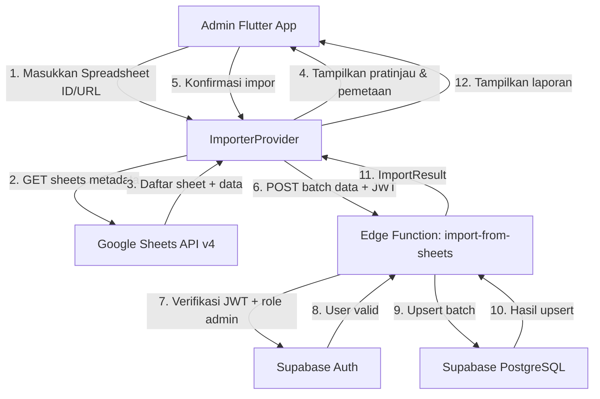
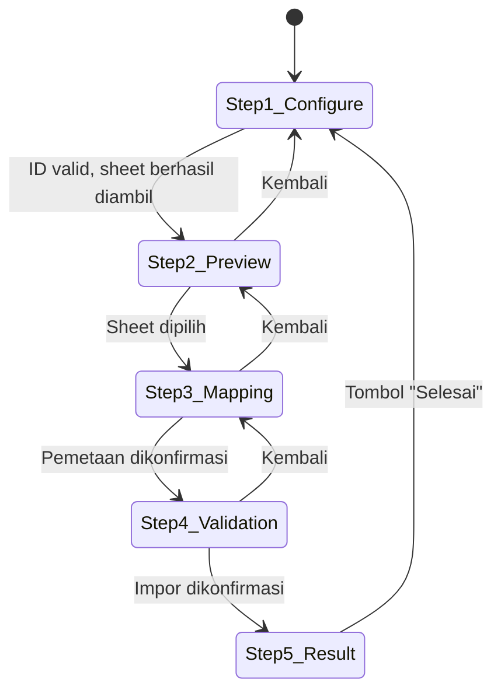

# Dokumen Desain: Google Sheets Data Import

## Ikhtisar

Fitur ini menyediakan alat migrasi data satu arah dari Google Spreadsheet (bekas database AppSheet) ke Supabase PostgreSQL. Alur kerja terdiri dari lima langkah berurutan: konfigurasi sumber → pratinjau data → pemetaan kolom → validasi → impor. Seluruh proses dikendalikan oleh admin melalui antarmuka Flutter yang baru, dengan logika impor berat dijalankan di Supabase Edge Function baru bernama `import-from-sheets`.

Spreadsheet target bersifat publik (_anyone with link_), sehingga akses Google Sheets API v4 menggunakan **API Key** (bukan OAuth), menyederhanakan autentikasi secara signifikan dibandingkan Edge Function yang sudah ada.

### Tujuan Desain

- Mengikuti pola arsitektur yang sudah ada: Repository pattern, Riverpod provider, GoRouter.
- Memisahkan tanggung jawab: Flutter menangani UI/state, Edge Function menangani I/O ke Supabase.
- Mendukung impor data ke empat tabel: `users`, `kegiatan`, `laporan`, `dokumentasi`.
- Memberikan umpan balik yang jelas kepada admin di setiap langkah proses.

> **Catatan Implementasi (Update):** Gambar/foto dari spreadsheet lama **tidak perlu diupload ulang** ke Google Drive baru. URL/link Drive yang sudah ada di kolom spreadsheet disimpan langsung ke field `image_url` di Supabase as-is. Kolom `image_url` pada skema `kSupabaseTableSchemas` untuk tabel `laporan` dan `dokumentasi` bersifat `required: false`.

---

## Arsitektur

### Gambaran Umum Alur Data



### Komponen Utama

| Komponen                     | Lokasi                                     | Tanggung Jawab                                               |
| ---------------------------- | ------------------------------------------ | ------------------------------------------------------------ |
| `ImportSheetsScreen`         | `lib/features/import_sheets/presentation/` | Wizard UI multi-langkah                                      |
| `ImportSheetsProvider`       | `lib/features/import_sheets/presentation/` | State management Riverpod                                    |
| `ImportSheetsRepository`     | `lib/features/import_sheets/data/`         | Abstraksi akses data                                         |
| `ImportSheetsRepositoryImpl` | `lib/features/import_sheets/data/`         | Implementasi: Sheets API + Edge Function                     |
| `import-from-sheets`         | `supabase/functions/import-from-sheets/`   | Edge Function Deno: validasi JWT, upsert batch               |
| Model-model domain           | `lib/features/import_sheets/domain/`       | `SheetMetadata`, `SheetRow`, `ColumnMapping`, `ImportResult` |

### Struktur Direktori Baru

```
lib/features/import_sheets/
├── domain/
│   ├── sheet_metadata_model.dart
│   ├── sheet_row_model.dart
│   ├── column_mapping_model.dart
│   └── import_result_model.dart
├── data/
│   ├── import_sheets_repository.dart
│   └── import_sheets_repository_impl.dart
└── presentation/
    ├── import_sheets_provider.dart
    ├── import_sheets_provider.g.dart  (generated)
    ├── import_sheets_screen.dart
    └── steps/
        ├── step1_configure_screen.dart
        ├── step2_preview_screen.dart
        ├── step3_mapping_screen.dart
        ├── step4_validation_screen.dart
        └── step5_result_screen.dart

supabase/functions/import-from-sheets/
└── index.ts
```

---

## Komponen dan Antarmuka

### 1. Repository Interface

```dart
// lib/features/import_sheets/data/import_sheets_repository.dart

abstract class ImportSheetsRepository {
  /// Mengambil metadata spreadsheet (daftar sheet) dari Google Sheets API.
  Future<List<SheetMetadataModel>> getSheetList(String spreadsheetId);

  /// Mengambil data dari sheet tertentu (header + semua baris).
  Future<List<SheetRowModel>> getSheetData(
    String spreadsheetId,
    String sheetName,
  );

  /// Mengirim batch data ke Edge Function untuk diimpor ke Supabase.
  Future<ImportResultModel> importBatch({
    required String targetTable,
    required List<Map<String, dynamic>> rows,
    required String jwtToken,
  });
}
```

### 2. Repository Implementation

`ImportSheetsRepositoryImpl` mengimplementasikan interface di atas:

- **`getSheetList`**: Memanggil `GET https://sheets.googleapis.com/v4/spreadsheets/{id}?key={API_KEY}&fields=sheets.properties` untuk mendapatkan daftar sheet.
- **`getSheetData`**: Memanggil `GET https://sheets.googleapis.com/v4/spreadsheets/{id}/values/{sheetName}?key={API_KEY}` untuk mendapatkan semua nilai.
- **`importBatch`**: Memanggil `POST {SUPABASE_URL}/functions/v1/import-from-sheets` dengan body JSON berisi `targetTable` dan `rows`, serta header `Authorization: Bearer {jwtToken}`.

### 3. Riverpod Providers

```dart
// lib/features/import_sheets/presentation/import_sheets_provider.dart

// State wizard impor
@riverpod
class ImportSheetsNotifier extends _$ImportSheetsNotifier {
  // State: langkah saat ini, spreadsheetId, daftar sheet,
  //        sheet terpilih, data pratinjau, konfigurasi pemetaan,
  //        hasil validasi, hasil impor
}

// Provider untuk daftar sheet (dipanggil setelah ID dikonfigurasi)
@riverpod
Future<List<SheetMetadataModel>> sheetList(
  Ref ref,
  String spreadsheetId,
) async { ... }

// Provider untuk data pratinjau sheet terpilih
@riverpod
Future<List<SheetRowModel>> sheetPreview(
  Ref ref,
  String spreadsheetId,
  String sheetName,
) async { ... }
```

### 4. Edge Function: `import-from-sheets`

**Endpoint**: `POST /functions/v1/import-from-sheets`

**Request Body**:

```json
{
  "targetTable": "kegiatan",
  "rows": [
    { "judul": "Rapat Koordinasi", "deadline": "2024-01-15", "deskripsi": "..." },
    ...
  ]
}
```

**Response (sukses)**:

```json
{
  "success": true,
  "imported": 95,
  "failed": 5,
  "errors": [
    { "rowIndex": 3, "data": {...}, "message": "duplicate key value" }
  ]
}
```

**Response (error)**:

```json
{
  "success": false,
  "error": "Unauthorized"
}
```

### 5. Konfigurasi Kolom Tabel (Statis)

Definisi kolom tabel Supabase disimpan sebagai konstanta di sisi Flutter untuk mendukung UI pemetaan:

```dart
// lib/features/import_sheets/domain/table_schema_config.dart

const Map<String, List<ColumnDefinition>> kSupabaseTableSchemas = {
  'users': [
    ColumnDefinition(name: 'nama', type: 'text', required: true),
    ColumnDefinition(name: 'email', type: 'text', required: true),
    ColumnDefinition(name: 'jabatan', type: 'text', required: false),
    ColumnDefinition(name: 'unit_kerja', type: 'text', required: false),
    ColumnDefinition(name: 'role', type: 'text', required: true),
  ],
  'kegiatan': [
    ColumnDefinition(name: 'judul', type: 'text', required: true),
    ColumnDefinition(name: 'deskripsi', type: 'text', required: false),
    ColumnDefinition(name: 'deadline', type: 'date', required: true),
  ],
  'laporan': [
    ColumnDefinition(name: 'user_id', type: 'uuid', required: true),
    ColumnDefinition(name: 'catatan', type: 'text', required: false),
    ColumnDefinition(name: 'image_url', type: 'text', required: false), // URL Drive as-is dari spreadsheet
    ColumnDefinition(name: 'created_at', type: 'timestamp', required: false),
  ],
  'dokumentasi': [
    ColumnDefinition(name: 'user_id', type: 'uuid', required: true),
    ColumnDefinition(name: 'proyek', type: 'text', required: true),
    ColumnDefinition(name: 'tanggal_kegiatan', type: 'date', required: true),
    ColumnDefinition(name: 'catatan', type: 'text', required: false),
    ColumnDefinition(name: 'link', type: 'text', required: false),
    ColumnDefinition(name: 'image_url', type: 'text', required: false), // URL Drive as-is dari spreadsheet
  ],
};
```

### 6. Routing

Halaman impor ditambahkan ke dalam `ShellRoute` admin yang sudah ada:

```dart
// Tambahan di app_router.dart (dalam ShellRoute admin)
GoRoute(
  path: '/admin/import-sheets',
  builder: (context, state) => const ImportSheetsScreen(),
),
```

Navigasi dari `AdminScaffold` atau `AdminDashboardScreen` dengan menambahkan menu/tombol baru.

---

## Model Data

### `SheetMetadataModel`

```dart
class SheetMetadataModel {
  final String sheetId;
  final String title;
  final int index;

  const SheetMetadataModel({
    required this.sheetId,
    required this.title,
    required this.index,
  });

  factory SheetMetadataModel.fromMap(Map<String, dynamic> map) {
    final props = map['properties'] as Map<String, dynamic>;
    return SheetMetadataModel(
      sheetId: props['sheetId'].toString(),
      title: props['title'] as String,
      index: props['index'] as int,
    );
  }
}
```

### `SheetRowModel`

```dart
class SheetRowModel {
  final int rowIndex;
  final List<String> values;

  const SheetRowModel({required this.rowIndex, required this.values});
}
```

Data mentah dari Google Sheets API dikembalikan sebagai `List<List<Object>>`. Baris pertama (`index 0`) adalah header; baris berikutnya adalah data.

### `ColumnMappingModel`

```dart
class ColumnMappingModel {
  final String sourceColumn;   // Nama kolom dari header sheet
  final String? targetColumn;  // Nama kolom di tabel Supabase (null = abaikan)
  final bool isIgnored;

  const ColumnMappingModel({
    required this.sourceColumn,
    this.targetColumn,
    this.isIgnored = false,
  });
}
```

### `ValidationResultModel`

```dart
class ValidationResultModel {
  final int totalRows;
  final int validRows;
  final int invalidRows;
  final List<RowValidationError> errors;
}

class RowValidationError {
  final int rowIndex;
  final String columnName;
  final String value;
  final String message;
}
```

### `ImportResultModel`

```dart
class ImportResultModel {
  final int totalProcessed;
  final int successCount;
  final int failedCount;
  final Duration duration;
  final List<ImportRowError> errors;
}

class ImportRowError {
  final int rowIndex;
  final Map<String, dynamic> originalData;
  final String message;
}
```

### Diagram Alur State Wizard



---

## Correctness Properties

_A property is a characteristic or behavior that should hold true across all valid executions of a system — essentially, a formal statement about what the system should do. Properties serve as the bridge between human-readable specifications and machine-verifiable correctness guarantees._

### Property 1: Ekstraksi Spreadsheet ID dari URL

_Untuk semua_ URL Google Spreadsheet yang valid dengan format standar `https://docs.google.com/spreadsheets/d/{ID}/...`, fungsi ekstraksi SHALL selalu menghasilkan Spreadsheet_ID yang sama persis dengan ID yang tertanam dalam URL tersebut.

**Validates: Requirements 1.2, 1.5**

---

### Property 2: Penolakan Input Tidak Valid

_Untuk semua_ string yang bukan URL Google Spreadsheet valid dan bukan Spreadsheet_ID valid (string kosong, URL domain lain, ID dengan karakter ilegal), fungsi validasi SHALL selalu mengembalikan hasil `invalid` dan tidak pernah menghasilkan ID yang dapat digunakan.

**Validates: Requirements 1.4**

---

### Property 3: Pratinjau Dibatasi Maksimal 10 Baris

_Untuk semua_ sheet dengan jumlah baris data N (tidak termasuk header), data pratinjau yang ditampilkan SHALL selalu berisi `min(N, 10)` baris — tidak pernah lebih dari 10 baris, dan tidak pernah kurang dari jumlah baris yang tersedia jika N ≤ 10.

**Validates: Requirements 3.1**

---

### Property 4: Jumlah Baris Data Akurat

_Untuk semua_ sheet dengan N baris total (termasuk 1 baris header), jumlah baris data yang ditampilkan SHALL selalu sama dengan `N - 1`.

**Validates: Requirements 3.3**

---

### Property 5: Peringatan Kolom Required Tidak Dipetakan

_Untuk semua_ konfigurasi pemetaan kolom di mana setidaknya satu kolom `required: true` dari tabel tujuan tidak memiliki pemetaan (atau ditandai `isIgnored: true`), sistem SHALL selalu menampilkan peringatan sebelum impor dimulai.

**Validates: Requirements 4.6**

---

### Property 6: Konsistensi Jumlah Validasi

_Untuk semua_ dataset dengan N baris data, setelah proses validasi selesai, jumlah baris valid ditambah jumlah baris invalid SHALL selalu sama dengan N.

**Validates: Requirements 5.4**

---

### Property 7: Validasi Tanggal Menolak Format Tidak Valid

_Untuk semua_ nilai string yang tidak dapat diparse menjadi tanggal ISO 8601 atau format tanggal umum (dd/MM/yyyy, MM/dd/yyyy), fungsi validasi tanggal SHALL selalu mengklasifikasikan nilai tersebut sebagai error.

**Validates: Requirements 5.2**

---

### Property 8: Validasi Kolom Required Menolak Nilai Kosong

_Untuk semua_ baris data di mana kolom yang dipetakan ke kolom `required: true` berisi nilai kosong (string kosong, hanya spasi, atau null), fungsi validasi SHALL selalu mengklasifikasikan baris tersebut sebagai invalid.

**Validates: Requirements 5.3**

---

### Property 9: Ukuran Batch Tidak Melebihi 100

_Untuk semua_ dataset dengan ukuran N baris (N ≥ 1), fungsi pembagi batch SHALL menghasilkan daftar batch di mana setiap batch berisi paling banyak 100 baris, dan total baris di semua batch sama dengan N.

**Validates: Requirements 6.4**

---

### Property 10: Konsistensi Statistik Hasil Impor

_Untuk semua_ hasil impor, jumlah baris berhasil ditambah jumlah baris gagal SHALL selalu sama dengan total baris yang diproses.

**Validates: Requirements 7.2**

---

### Property 11: Otorisasi Akses Fitur Impor

_Untuk semua_ pengguna yang terautentikasi dengan role selain `admin`, setiap upaya mengakses rute `/admin/import-sheets` SHALL selalu dialihkan ke halaman yang sesuai dengan role-nya, dan tidak pernah menampilkan halaman impor.

**Validates: Requirements 8.1, 8.2**

---

### Property 12: Penolakan Permintaan Edge Function Tanpa Otorisasi Valid

_Untuk semua_ permintaan ke Edge Function `import-from-sheets` yang tidak memiliki JWT valid atau berasal dari pengguna dengan role bukan `admin`, Edge Function SHALL selalu mengembalikan HTTP 403 dan tidak pernah memproses data impor.

**Validates: Requirements 8.3, 8.4, 8.5**

---

### Property 13: Batas Percobaan Ulang

_Untuk semua_ skenario error jaringan yang dapat dipulihkan, mekanisme retry SHALL melakukan percobaan ulang paling banyak 3 kali dan tidak pernah melebihi batas tersebut sebelum menampilkan pesan error kepada admin.

**Validates: Requirements 9.5**

---

## Penanganan Error

### Kategori Error dan Respons

| Kategori                         | Kondisi                          | Respons Sistem                                                                                                           |
| -------------------------------- | -------------------------------- | ------------------------------------------------------------------------------------------------------------------------ |
| **Input Tidak Valid**            | URL/ID format salah              | Pesan error inline di field input, tidak lanjut ke langkah berikutnya                                                    |
| **Spreadsheet Tidak Ditemukan**  | HTTP 404 dari Sheets API         | Pesan error: "Spreadsheet tidak ditemukan. Periksa ID atau URL."                                                         |
| **Spreadsheet Privat**           | HTTP 403 dari Sheets API         | Pesan error: "Spreadsheet tidak dapat diakses. Pastikan spreadsheet dapat diakses oleh siapa saja yang memiliki tautan." |
| **API Key Tidak Valid**          | HTTP 400/403 dari Sheets API     | Pesan error: "Konfigurasi API Key tidak valid. Hubungi administrator sistem."                                            |
| **Sheet Kosong**                 | Respons data kosong              | Pesan informasi: "Sheet ini tidak memiliki data untuk diimpor."                                                          |
| **Timeout Sheets API**           | Tidak ada respons dalam 30 detik | Pesan error + tombol "Coba Lagi"                                                                                         |
| **Error Jaringan (Recoverable)** | Network error sementara          | Retry otomatis 3x dengan jeda 2 detik, lalu tampilkan error                                                              |
| **Timeout Edge Function**        | Tidak ada respons dalam 60 detik | Tampilkan hasil parsial yang sudah berhasil diproses                                                                     |
| **Koneksi Supabase Terputus**    | Error saat impor berlangsung     | Hentikan impor, tampilkan hasil parsial                                                                                  |
| **Unauthorized (Edge Function)** | JWT tidak valid atau bukan admin | HTTP 403, Flutter tampilkan "Sesi tidak valid, silakan login ulang."                                                     |
| **Error Upsert per Baris**       | Constraint violation, dll.       | Catat error, lanjutkan baris berikutnya, tampilkan di laporan akhir                                                      |

### Strategi Retry

```dart
Future<T> withRetry<T>(
  Future<T> Function() operation, {
  int maxAttempts = 3,
  Duration delay = const Duration(seconds: 2),
}) async {
  for (int attempt = 1; attempt <= maxAttempts; attempt++) {
    try {
      return await operation().timeout(const Duration(seconds: 30));
    } on TimeoutException catch (_) {
      if (attempt == maxAttempts) rethrow;
      await Future.delayed(delay);
    } on SocketException catch (_) {
      if (attempt == maxAttempts) rethrow;
      await Future.delayed(delay);
    }
  }
  throw AppException('Gagal setelah $maxAttempts percobaan');
}
```

### Error Handling di Edge Function

```typescript
// Setiap baris diproses secara individual dalam try-catch
const errors: ImportRowError[] = []
let successCount = 0

for (const [index, row] of rows.entries()) {
  try {
    await supabase.from(targetTable).upsert(row)
    successCount++
  } catch (err) {
    errors.push({
      rowIndex: index,
      data: row,
      message: (err as Error).message
    })
  }
}
```

---

## Strategi Pengujian

### Pendekatan Pengujian Ganda

Fitur ini menggunakan dua pendekatan pengujian yang saling melengkapi:

1. **Unit Test / Example Test**: Menguji skenario spesifik, edge case, dan error condition.
2. **Property-Based Test (PBT)**: Menguji properti universal yang harus berlaku untuk semua input valid.

Library PBT yang digunakan: [`fast_check`](https://pub.dev/packages/fast_check) untuk Dart.

Setiap property test dikonfigurasi untuk menjalankan **minimum 100 iterasi**.

### Unit Tests

**`import_sheets_repository_impl_test.dart`**:

- Uji `getSheetList` dengan mock HTTP response sukses dan error (404, 403, timeout).
- Uji `getSheetData` dengan sheet kosong, sheet hanya header, sheet dengan data.
- Uji `importBatch` dengan mock Edge Function response sukses dan error.

**`column_mapping_test.dart`**:

- Uji bahwa semua tabel yang didukung tersedia sebagai pilihan.
- Uji bahwa kolom required terdeteksi dengan benar dari `kSupabaseTableSchemas`.

**`import_sheets_screen_test.dart`**:

- Uji navigasi antar langkah wizard.
- Uji bahwa pengguna non-admin diarahkan ke halaman yang sesuai.
- Uji tampilan pesan error untuk berbagai kondisi.

### Property-Based Tests

Setiap property test di bawah ini mengimplementasikan satu Correctness Property dari dokumen ini.

```dart
// Feature: google-sheets-data-import, Property 1: Ekstraksi Spreadsheet ID dari URL
test('ekstraksi ID dari URL selalu menghasilkan ID yang benar', () {
  fc.assert(
    fc.property(
      fc.string().filter((s) => s.isNotEmpty), // generate ID acak
      (spreadsheetId) {
        final url = 'https://docs.google.com/spreadsheets/d/$spreadsheetId/edit';
        final extracted = extractSpreadsheetId(url);
        expect(extracted, equals(spreadsheetId));
      },
    ),
    numRuns: 100,
  );
});

// Feature: google-sheets-data-import, Property 3: Pratinjau Dibatasi Maksimal 10 Baris
test('pratinjau tidak pernah melebihi 10 baris', () {
  fc.assert(
    fc.property(
      fc.integer(min: 0, max: 200), // jumlah baris data
      (rowCount) {
        final rows = List.generate(rowCount, (i) => SheetRowModel(rowIndex: i + 1, values: ['data$i']));
        final preview = limitPreviewRows(rows);
        expect(preview.length, lessThanOrEqualTo(10));
        expect(preview.length, equals(min(rowCount, 10)));
      },
    ),
    numRuns: 100,
  );
});

// Feature: google-sheets-data-import, Property 6: Konsistensi Jumlah Validasi
test('valid + invalid selalu sama dengan total baris', () {
  fc.assert(
    fc.property(
      fc.list(fc.record({...})), // generate baris data acak
      (rows) {
        final result = validateRows(rows, mappings);
        expect(result.validRows + result.invalidRows, equals(rows.length));
      },
    ),
    numRuns: 100,
  );
});

// Feature: google-sheets-data-import, Property 9: Ukuran Batch Tidak Melebihi 100
test('setiap batch berisi paling banyak 100 baris', () {
  fc.assert(
    fc.property(
      fc.integer(min: 1, max: 1000),
      (rowCount) {
        final rows = List.generate(rowCount, (i) => <String, dynamic>{'id': i});
        final batches = splitIntoBatches(rows, batchSize: 100);
        for (final batch in batches) {
          expect(batch.length, lessThanOrEqualTo(100));
        }
        expect(batches.fold(0, (sum, b) => sum + b.length), equals(rowCount));
      },
    ),
    numRuns: 100,
  );
});
```

### Integration Tests

- Uji koneksi ke Google Sheets API dengan Spreadsheet ID nyata (`1IvEhH5DvIDKKg7U61StDUAr6hYlyeYQYjzibnC4Bxj4`).
- Uji Edge Function `import-from-sheets` dengan data nyata ke Supabase staging.
- Uji bahwa JWT verification di Edge Function berfungsi (token valid vs. tidak valid).

### Smoke Tests

- Verifikasi bahwa `GOOGLE_SHEETS_API_KEY` tersedia sebagai environment variable di Flutter.
- Verifikasi bahwa Edge Function `import-from-sheets` ter-deploy dan dapat diakses.
- Verifikasi bahwa timeout 30 detik (Sheets API) dan 60 detik (Edge Function) dikonfigurasi.
