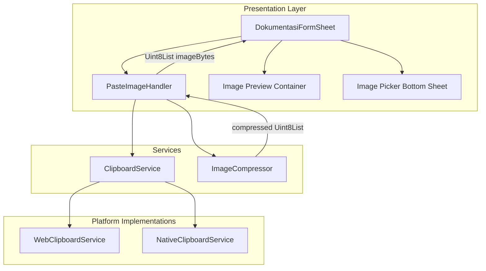
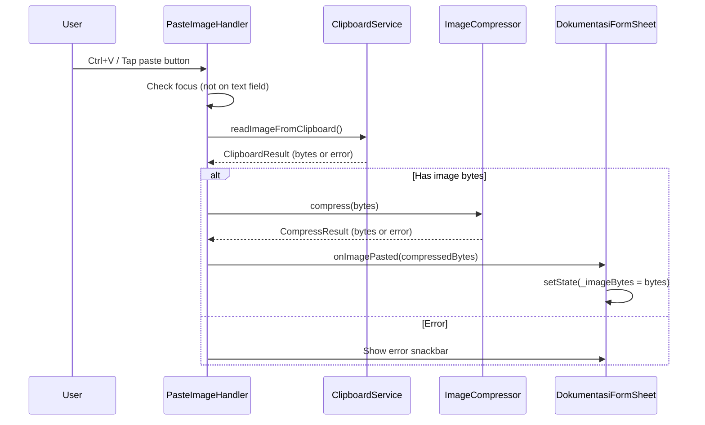
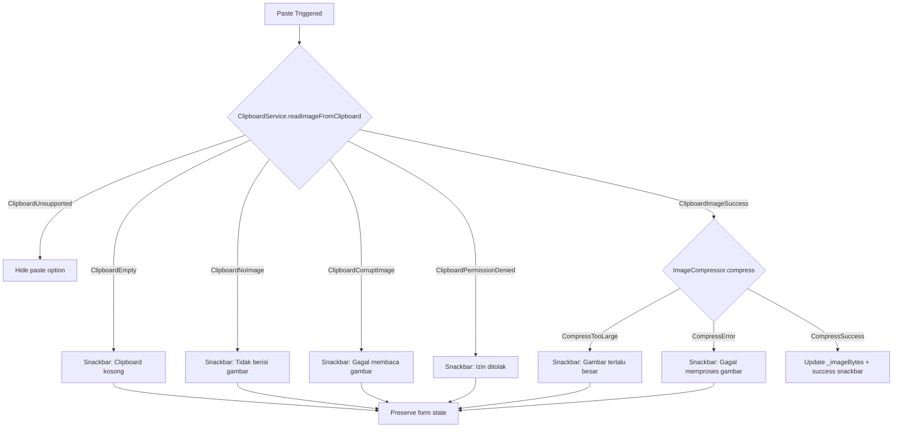

# Design Document: Paste Image Documentation

## Overview

This design adds clipboard image paste capability to the existing `DokumentasiFormSheet` widget. The feature introduces three new components — `ClipboardService`, `PasteImageHandler`, and `ImageCompressor` — that integrate with the existing form's `_imageBytes` state to provide a seamless paste-to-preview workflow.

The architecture follows the existing project patterns: Riverpod for state management, platform-conditional logic via `kIsWeb` and `Platform` checks, and a layered structure (data/domain/presentation). The paste feature is additive — it extends the existing image picker flow without modifying the camera/gallery paths.

### Key Design Decisions

1. **Service-based clipboard access**: A `ClipboardService` abstraction allows platform-specific implementations (web Clipboard API vs. native) while keeping the form widget platform-agnostic.
2. **Focus-aware keyboard handling**: `PasteImageHandler` wraps the form with a `Focus` widget that intercepts Ctrl+V only when text fields are not focused, preserving normal text paste behavior.
3. **Progressive compression**: `ImageCompressor` uses a quality-reduction loop (80% → 40%) to meet the 5MB limit, avoiding unnecessary re-encoding when images are already small.
4. **No new dependencies**: The implementation uses `dart:ui` for image decoding/encoding and the `http` package (already in pubspec) for web clipboard blob handling. No additional packages are required.

## Architecture



### Data Flow



## Components and Interfaces

### 1. ClipboardService (Abstract)

**Location**: `lib/core/services/clipboard_service.dart`

```dart
/// Result of a clipboard read operation.
sealed class ClipboardReadResult {}

class ClipboardImageSuccess extends ClipboardReadResult {
  final Uint8List imageBytes;
  ClipboardImageSuccess(this.imageBytes);
}

class ClipboardEmpty extends ClipboardReadResult {}

class ClipboardNoImage extends ClipboardReadResult {}

class ClipboardCorruptImage extends ClipboardReadResult {}

class ClipboardPermissionDenied extends ClipboardReadResult {}

class ClipboardUnsupported extends ClipboardReadResult {}

/// Platform-agnostic clipboard image reading interface.
abstract class ClipboardService {
  /// Reads image data from the system clipboard.
  /// Returns a [ClipboardReadResult] indicating success or failure type.
  Future<ClipboardReadResult> readImageFromClipboard();

  /// Whether clipboard paste is supported on the current platform.
  bool get isSupported;
}
```

### 2. WebClipboardService

**Location**: `lib/core/services/web_clipboard_service.dart`

Uses the browser `navigator.clipboard.read()` API via `dart:js_interop` to access clipboard items. Checks for `ClipboardItem` support and reads blobs with image MIME types (image/png, image/jpeg, image/webp).

```dart
class WebClipboardService implements ClipboardService {
  @override
  bool get isSupported => _hasClipboardApi();

  @override
  Future<ClipboardReadResult> readImageFromClipboard() async {
    // 1. Check API availability
    // 2. Call navigator.clipboard.read() with 5s timeout
    // 3. Iterate ClipboardItems for image/* types
    // 4. Read blob as Uint8List
    // 5. Validate image can be decoded
    // 6. Return appropriate result
  }
}
```

### 3. NativeClipboardService

**Location**: `lib/core/services/native_clipboard_service.dart`

Uses Flutter's `Clipboard.getData()` for basic clipboard access. On mobile platforms, image clipboard access is limited — this service primarily supports the "Paste dari Clipboard" button flow where the OS may provide image data through platform channels.

```dart
class NativeClipboardService implements ClipboardService {
  @override
  bool get isSupported => true; // Always show button on mobile

  @override
  Future<ClipboardReadResult> readImageFromClipboard() async {
    // 1. Attempt to read image data from platform clipboard
    // 2. Use MethodChannel for platform-specific image clipboard access
    // 3. Validate and return result
  }
}
```

### 4. ImageCompressor

**Location**: `lib/core/services/image_compressor.dart`

```dart
/// Result of image compression.
sealed class CompressResult {}

class CompressSuccess extends CompressResult {
  final Uint8List compressedBytes;
  CompressSuccess(this.compressedBytes);
}

class CompressTooLarge extends CompressResult {}

class CompressError extends CompressResult {
  final String message;
  CompressError(this.message);
}

/// Compresses and resizes images for upload.
class ImageCompressor {
  static const int maxDimension = 1920;
  static const int maxSizeBytes = 5 * 1024 * 1024; // 5 MB
  static const int startQuality = 80;
  static const int minQuality = 40;
  static const int qualityStep = 10;

  /// Compresses [imageBytes] to JPEG within size constraints.
  ///
  /// 1. Decodes image to determine dimensions
  /// 2. Resizes if exceeds [maxDimension] (maintains aspect ratio)
  /// 3. Replaces alpha channel with white background
  /// 4. Encodes as JPEG at [startQuality]%
  /// 5. If > [maxSizeBytes], reduces quality by [qualityStep] until
  ///    under limit or [minQuality] reached
  Future<CompressResult> compress(Uint8List imageBytes) async {
    // Implementation using dart:ui Image codec
  }
}
```

### 5. PasteImageHandler (Widget)

**Location**: `lib/features/dokumentasi/presentation/widgets/paste_image_handler.dart`

```dart
/// Wraps a child widget to handle paste keyboard shortcuts and
/// provide a paste callback for button-triggered paste.
class PasteImageHandler extends ConsumerStatefulWidget {
  final Widget child;
  final ValueChanged<Uint8List> onImagePasted;
  final VoidCallback? onError;

  const PasteImageHandler({
    super.key,
    required this.child,
    required this.onImagePasted,
    this.onError,
  });
}

class _PasteImageHandlerState extends ConsumerState<PasteImageHandler> {
  late final ClipboardService _clipboardService;

  @override
  void initState() {
    super.initState();
    _clipboardService = _createClipboardService();
  }

  /// Determines if the current focus is on a text input field.
  bool _isTextFieldFocused() {
    final focus = FocusManager.instance.primaryFocus;
    // Check if the focused widget's context contains a TextField/TextFormField
    return focus?.context?.widget is EditableText;
  }

  /// Handles the paste keyboard shortcut (Ctrl+V / Cmd+V).
  KeyEventResult _handleKeyEvent(FocusNode node, KeyEvent event) {
    if (event is! KeyDownEvent) return KeyEventResult.ignored;

    final isPaste = (HardwareKeyboard.instance.isControlPressed ||
                     HardwareKeyboard.instance.isMetaPressed) &&
                    event.logicalKey == LogicalKeyboardKey.keyV;

    if (!isPaste) return KeyEventResult.ignored;
    if (_isTextFieldFocused()) return KeyEventResult.ignored;

    _performPaste();
    return KeyEventResult.handled;
  }

  /// Executes the paste operation: read clipboard → compress → callback.
  Future<void> _performPaste() async {
    final result = await _clipboardService.readImageFromClipboard();
    // Handle result, compress if success, show error if failure
  }
}
```

### 6. ClipboardService Riverpod Provider

**Location**: `lib/core/services/clipboard_service_provider.dart`

```dart
@riverpod
ClipboardService clipboardService(Ref ref) {
  if (kIsWeb) return WebClipboardService();
  return NativeClipboardService();
}

@riverpod
ImageCompressor imageCompressor(Ref ref) {
  return ImageCompressor();
}
```

### 7. Updated DokumentasiFormSheet Integration

The existing `DokumentasiFormSheet` will be modified to:

1. Wrap its content with `PasteImageHandler` (on desktop/web)
2. Add "Paste dari Clipboard" option in `_showImagePicker()` bottom sheet
3. Add clipboard icon badge overlay on the image preview when image source is paste
4. Track image source (camera, gallery, paste) via an enum

```dart
enum ImageSource { camera, gallery, paste }

// In _DokumentasiFormSheetState:
ImageSourceType? _imageSourceType; // Track how image was added

// Updated _showImagePicker adds:
ListTile(
  leading: const Icon(Icons.content_paste, color: AppColors.info),
  title: const Text('Paste dari Clipboard'),
  onTap: () {
    Navigator.pop(ctx);
    _performClipboardPaste();
  },
),
```

## Data Models

### ClipboardReadResult (Sealed Class)

| Variant                     | Fields                 | Description                                           |
| --------------------------- | ---------------------- | ----------------------------------------------------- |
| `ClipboardImageSuccess`     | `Uint8List imageBytes` | Successfully read image bytes                         |
| `ClipboardEmpty`            | —                      | Clipboard has no content                              |
| `ClipboardNoImage`          | —                      | Clipboard has content but no image                    |
| `ClipboardCorruptImage`     | —                      | Image data cannot be decoded                          |
| `ClipboardPermissionDenied` | —                      | Platform denied clipboard access                      |
| `ClipboardUnsupported`      | —                      | Platform/browser doesn't support clipboard image read |

### CompressResult (Sealed Class)

| Variant            | Fields                      | Description                              |
| ------------------ | --------------------------- | ---------------------------------------- |
| `CompressSuccess`  | `Uint8List compressedBytes` | Compressed image within size limit       |
| `CompressTooLarge` | —                           | Cannot compress below 5MB at min quality |
| `CompressError`    | `String message`            | Unexpected error during compression      |

### ImageSourceType (Enum)

| Value     | Description                 |
| --------- | --------------------------- |
| `camera`  | Image captured via camera   |
| `gallery` | Image selected from gallery |
| `paste`   | Image pasted from clipboard |

### Platform Detection

The system uses Flutter's `kIsWeb` constant and `dart:io` `Platform` class to determine behavior:

| Platform      | Keyboard Shortcut | Paste Button | Clipboard API         |
| ------------- | ----------------- | ------------ | --------------------- |
| Web           | Ctrl+V / Cmd+V    | Hidden       | Browser Clipboard API |
| macOS         | Cmd+V             | Hidden       | Native clipboard      |
| Windows/Linux | Ctrl+V            | Hidden       | Native clipboard      |
| Android       | —                 | Shown        | Platform channel      |
| iOS           | —                 | Shown        | Platform channel      |

## Correctness Properties

_A property is a characteristic or behavior that should hold true across all valid executions of a system — essentially, a formal statement about what the system should do. Properties serve as the bridge between human-readable specifications and machine-verifiable correctness guarantees._

### Property 1: Valid image format acceptance

_For any_ valid image byte sequence in PNG, JPEG, or WEBP format, the ClipboardService SHALL successfully extract the bytes and the PasteImageHandler SHALL pass them to the form without data loss (input bytes equal output bytes before compression).

**Validates: Requirements 1.2, 1.4**

### Property 2: Image replacement preserves only new image

_For any_ existing image bytes in the form state and any newly pasted valid image bytes, after paste the form's `_imageBytes` SHALL equal the newly pasted image bytes (not the previous image).

**Validates: Requirements 1.5, 6.2**

### Property 3: Resize preserves aspect ratio within bounds

_For any_ image with width W and height H where max(W, H) > 1920, after compression the output dimensions (W', H') SHALL satisfy: max(W', H') <= 1920 AND abs(W'/H' - W/H) < epsilon (aspect ratio preserved within floating-point tolerance).

**Validates: Requirements 3.1**

### Property 4: Alpha channel replacement produces opaque JPEG

_For any_ input image with an alpha channel (transparency), the ImageCompressor SHALL produce output bytes that decode as a JPEG image with no alpha channel, where previously transparent pixels are rendered against a white (#FFFFFF) background.

**Validates: Requirements 3.2**

### Property 5: Progressive quality reduction converges

_For any_ image that initially compresses to > 5MB at 80% quality, the ImageCompressor SHALL attempt qualities [70, 60, 50, 40] in order, stopping at the first quality that produces output <= 5MB. If no quality produces output <= 5MB, it SHALL return `CompressTooLarge`.

**Validates: Requirements 3.3, 3.4**

### Property 6: Error result to message mapping is total and deterministic

_For any_ `ClipboardReadResult` error variant (ClipboardEmpty, ClipboardNoImage, ClipboardCorruptImage, ClipboardPermissionDenied), the error handler SHALL produce exactly one predetermined snackbar message string corresponding to that variant, with no variant left unmapped.

**Validates: Requirements 5.1, 5.2, 5.3, 5.4**

### Property 7: Form state preservation on error

_For any_ form state (selected image, catatan text, selected proyek, selected date) and any error-type `ClipboardReadResult`, after the error is handled the form state SHALL be identical to the state before the paste attempt.

**Validates: Requirements 5.5**

### Property 8: Focus-based paste routing

_For any_ keyboard event where Ctrl+V (or Cmd+V) is pressed: IF the primary focus is on an EditableText widget, THEN the PasteImageHandler SHALL return `KeyEventResult.ignored` (allowing default text paste). IF the primary focus is NOT on an EditableText widget, THEN the PasteImageHandler SHALL initiate clipboard read.

**Validates: Requirements 6.6, 7.2, 7.3**

### Property 9: Non-paste keyboard shortcuts pass through

_For any_ keyboard shortcut that is NOT Ctrl+V/Cmd+V (including Ctrl+C, Ctrl+A, Ctrl+Z, Ctrl+X, and any other combination), the PasteImageHandler SHALL return `KeyEventResult.ignored` without modifying any state.

**Validates: Requirements 7.1**

### Property 10: Image priority in mixed clipboard content

_For any_ clipboard state containing both text data and image data, when paste is triggered with focus NOT on a text field, the PasteImageHandler SHALL extract and use the image data, ignoring the text data.

**Validates: Requirements 7.5**

## Error Handling

### Error Flow Diagram



### Error Messages

| Error Type                        | Message                                                                  | Duration |
| --------------------------------- | ------------------------------------------------------------------------ | -------- |
| Clipboard empty                   | "Clipboard kosong. Salin gambar terlebih dahulu."                        | 3s       |
| No image in clipboard             | "Clipboard tidak berisi gambar. Salin screenshot terlebih dahulu."       | 3s       |
| Corrupt/undecodable image         | "Gagal membaca gambar dari clipboard. Coba salin ulang."                 | 3s       |
| Permission denied                 | "Izin akses clipboard ditolak. Periksa pengaturan izin aplikasi."        | 4s       |
| Image too large after compression | "Gambar terlalu besar. Coba gunakan gambar dengan resolusi lebih kecil." | 3s       |
| Unexpected compression error      | "Gagal memproses gambar. Coba lagi."                                     | 3s       |

### Error Handling Principles

1. **State preservation**: All errors preserve the current form state completely — no partial updates.
2. **Snackbar stacking**: New errors dismiss any existing error snackbar before showing the new one. Use `ScaffoldMessenger.of(context).hideCurrentSnackBar()` before showing.
3. **Timeout handling**: ClipboardService operations have a 5-second timeout. Timeout produces a `ClipboardCorruptImage` result (treated as unreadable).
4. **Graceful degradation**: If `ClipboardService.isSupported` returns false, the paste UI is hidden entirely — no error state needed.
5. **Retry**: After any error, the user can immediately retry paste without additional steps.

## Testing Strategy

### Property-Based Tests (using `fast_check` Dart package)

Each correctness property will be implemented as a property-based test with minimum 100 iterations.

| Property                | Test Target                           | Generator Strategy                                           |
| ----------------------- | ------------------------------------- | ------------------------------------------------------------ |
| P1: Format acceptance   | `ClipboardService` + format detection | Generate random byte arrays with valid PNG/JPEG/WEBP headers |
| P2: Image replacement   | Form state management                 | Generate pairs of random Uint8List (old, new)                |
| P3: Resize bounds       | `ImageCompressor.compress`            | Generate random (width, height) pairs, some > 1920           |
| P4: Alpha replacement   | `ImageCompressor.compress`            | Generate images with random alpha values                     |
| P5: Quality reduction   | `ImageCompressor.compress`            | Generate large images that exceed 5MB at 80%                 |
| P6: Error mapping       | Error handler function                | Generate all `ClipboardReadResult` error variants            |
| P7: State preservation  | Form state + error handling           | Generate random form states + random error types             |
| P8: Focus routing       | `PasteImageHandler._handleKeyEvent`   | Generate (focus state, key event) pairs                      |
| P9: Non-paste shortcuts | `PasteImageHandler._handleKeyEvent`   | Generate random non-Ctrl+V key combinations                  |
| P10: Image priority     | `ClipboardService`                    | Generate mixed clipboard states (text + image)               |

**Configuration:**

- Library: `fast_check` (Dart property-based testing library)
- Minimum iterations: 100 per property
- Tag format: `// Feature: paste-image-documentation, Property {N}: {title}`

### Unit Tests (Example-Based)

| Test                                                     | Validates |
| -------------------------------------------------------- | --------- |
| Snackbar appears on successful paste                     | Req 1.6   |
| Keyboard listener registered on desktop/web              | Req 2.1   |
| Paste button shown on mobile                             | Req 2.2   |
| Paste option hidden when unsupported                     | Req 2.5   |
| Clipboard badge shown on pasted image                    | Req 4.2   |
| Bottom sheet shows all options after paste               | Req 4.3   |
| "Hapus Foto" resets to empty state                       | Req 4.5   |
| Snackbar dismissed on new error                          | Req 5.7   |
| Bottom sheet dismissed before clipboard read             | Req 6.5   |
| No error shown for text-only clipboard on non-text focus | Req 7.4   |

### Integration Tests

| Test                                          | Validates    |
| --------------------------------------------- | ------------ |
| Full paste → compress → preview → submit flow | Req 6.3, 6.4 |
| Clipboard timeout at 5 seconds                | Req 2.3      |
| Compression completes within 10 seconds       | Req 3.5      |

### Test Organization

```
test/
  features/
    dokumentasi/
      services/
        clipboard_service_test.dart      # P1, P6, P10
        image_compressor_test.dart       # P3, P4, P5
      presentation/
        paste_image_handler_test.dart    # P8, P9
        dokumentasi_form_sheet_test.dart # P2, P7, unit tests
  integration/
    paste_image_flow_test.dart           # Integration tests
```
